<div align="center">

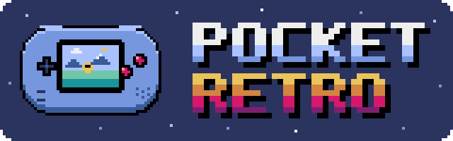

### Pyxel games, compiled for the Game Boy Advance

[](LICENSE)
[](#quick-start)
[](https://github.com/kitao/pyxel)
[](sdk/)
[](runtime/gba/)
[](tools/)
[](https://github.com/pocket-nexus/pocketjs)

[Games](#games) ·
[Quick start](#quick-start) ·
[Write a game](#write-a-game) ·
[Port a Pyxel game](#port-a-pyxel-game) ·
[How it works](#how-it-works) ·
[Acknowledgements](#acknowledgements)

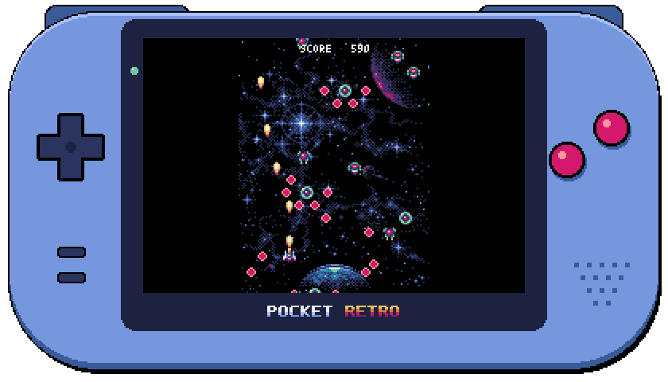

</div>

**Pocket Retro** runs games made with [Pyxel](https://github.com/kitao/pyxel),
the retro game engine for Python, on a **Game Boy Advance**: as real
cartridge ROMs that play in any GBA emulator, or on the console itself from a
flash cart.

Nothing interprets Python or JavaScript on the console. A game is ported to
TypeScript against a Pyxel-compatible SDK, compiled ahead of time by
[PocketJS](https://github.com/pocket-nexus/pocketjs) **MicroTS** to Rust, and
linked with a small bare-metal runtime into a ROM. The game's `.pyxres`,
`.pyxpal` and image files go into the cartridge as they are.

## Highlights

- 🎮 **Pyxel's API in TypeScript.** `blt`, `bltm`, `tilemap`, `pal`,
  `dither`, `clip`, `camera`, `text`, `btnp`, `sound.mml`, `music.play`… with
  Pyxel's names and behavior, grouped in namespaces that cost nothing at run
  time.
- 🎵 **Pyxel's sound, note for note.** Sounds and MML compile to the command
  lists pyxel-core 2.9 plays, run on Pyxel's 1,789,773 Hz clock and are mixed
  into four voices on the GBA.
- ⚡ **Bare metal and fast.** Integer and fixed-point rasterization (the GBA
  has no FPU), hot loops placed in IWRAM as ARM code, games from 10 to
  60 fps, screens up to 240 × 160 shown 1:1 or scaled up by a whole factor.
- 📦 **Resources baked as they are.** Image banks and tilemaps are read in
  place from the cartridge; a bank moves to RAM only when the game draws into
  it.
- 🔬 **Headless tooling.** A built-in mGBA runner plays ROMs with scripted
  input and saves screenshots, WAV audio and GIFs; a sampling profiler
  attributes CPU cycles to TypeScript functions.
- 🤖 **Made to be ported by agents.** A written
  [skill](skills/port-pyxel-game/SKILL.md) takes a coding agent from a Pyxel
  game to a ROM that holds its frame rate.

## Games

Every game below is a Pyxel game, ported to TypeScript and running on the
GBA at its original resolution and frame rate, and every GIF is recorded
from its ROM. The first six are the apps that ship with Pyxel, the others
Pyxel's own examples. `games/draw_api` ports Pyxel's drawing API demo, and
`games/hello` is the smallest possible game.

<table>
<tr>
<td align="center" valign="top">
<a href="games/mega_wing/game.ts">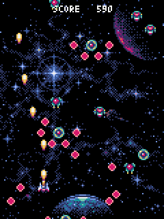</a><br>
<b>Mega Wing</b> by Takashi Kitao<br>
<sub>A shoot'em up with lots of bullets<br>120 × 160 at 30 fps · <a href="https://kitao.github.io/pyxel/web/showcase/apps/mega-wing.html">play the original</a></sub>
</td>
<td align="center" valign="top">
<a href="games/megaball/game.ts">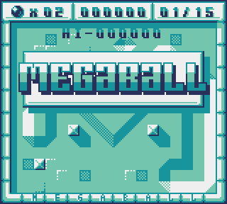</a><br>
<b>Megaball</b> by Adam<br>
<sub>Arcade ball physics, made for Game Boy Jam 8<br>160 × 144 at 60 fps · <a href="https://kitao.github.io/pyxel/web/showcase/apps/megaball.html">play the original</a></sub>
</td>
</tr>
<tr>
<td align="center" valign="top">
<a href="games/cursed_caverns/game.ts">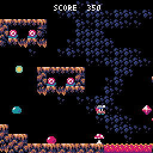</a><br>
<b>Cursed Caverns</b> by Takashi Kitao<br>
<sub>A platformer to avoid traps and collect gems<br>128 × 128 at 30 fps · <a href="https://kitao.github.io/pyxel/web/showcase/apps/cursed-caverns.html">play the original</a></sub>
</td>
<td align="center" valign="top">
<a href="games/laser_jetman/game.ts">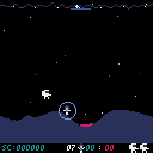</a><br>
<b>Laser Jetman</b> by Adam<br>
<sub>An arcade shooter inspired by Defender<br>128 × 128 at 60 fps · <a href="https://kitao.github.io/pyxel/web/showcase/apps/laser-jetman.html">play the original</a></sub>
</td>
</tr>
<tr>
<td align="center" valign="top">
<a href="games/daylight/game.ts">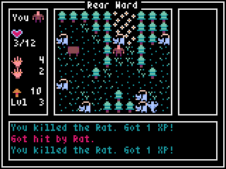</a><br>
<b>30 Seconds of Daylight</b> by Adam<br>
<sub>The first Pyxel Jam winner, a roguelike<br>160 × 120 at 10 fps · <a href="https://kitao.github.io/pyxel/web/showcase/apps/30sec-of-daylight.html">play the original</a></sub>
</td>
<td align="center" valign="top">
<a href="games/space_rescue/game.ts">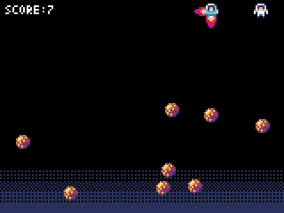</a><br>
<b>Space Rescue</b> by Takashi Kitao<br>
<sub>A one-key game to rescue astronauts<br>160 × 120 at 30 fps · <a href="https://kitao.github.io/pyxel/web/showcase/apps/space-rescue.html">play the original</a></sub>
</td>
</tr>
<tr>
<td align="center" valign="top">
<a href="games/jump/game.ts">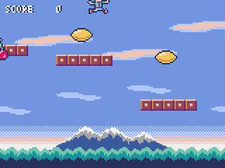</a><br>
<b>Pyxel Jump</b> by Takashi Kitao<br>
<sub>Pyxel's jump game example<br>160 × 120 at 30 fps · <a href="https://kitao.github.io/pyxel/web/showcase/examples/02-jump-game.html">play the original</a></sub>
</td>
<td align="center" valign="top">
<a href="games/platformer/game.ts">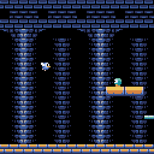</a><br>
<b>Pyxel Platformer</b> by Takashi Kitao<br>
<sub>Pyxel's platformer example<br>128 × 128 at 30 fps · <a href="https://kitao.github.io/pyxel/web/showcase/examples/10-platformer.html">play the original</a></sub>
</td>
</tr>
<tr>
<td align="center" valign="top">
<a href="games/shooter/game.ts">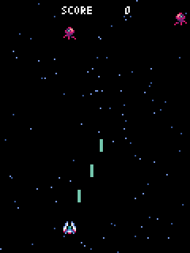</a><br>
<b>Pyxel Shooter</b> by Takashi Kitao<br>
<sub>Pyxel's shoot'em up example<br>120 × 160 at 30 fps · <a href="https://kitao.github.io/pyxel/web/showcase/examples/09-shooter.html">play the original</a></sub>
</td>
<td align="center" valign="top">
<a href="games/snake/game.ts">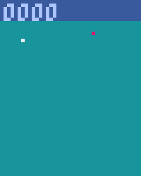</a><br>
<b>Snake!</b> by Marcus Croucher<br>
<sub>Pyxel's snake example<br>40 × 50 at 20 fps · <a href="https://kitao.github.io/pyxel/web/showcase/examples/07-snake.html">play the original</a></sub>
</td>
</tr>
</table>

Click a GIF to read the port; "play the original" opens the Pyxel version in
your browser. The two 60 fps games still slow down for a moment in their
busiest scenes: Megaball on its last stages, when dozens of lights change at
once, and Laser Jetman during a few seconds of flying, firing and explosions.

## Quick start

You need [Bun](https://bun.sh), Rust nightly with `rust-src`, and CMake,
Ninja and a C compiler for the headless emulator the tools use. The details
are in [AGENTS.md](AGENTS.md#prerequisites).

```sh
git clone --recursive https://github.com/pocket-nexus/pocket-retro.git
cd pocket-retro
bun install && bun install --cwd pocketjs
rustup toolchain install nightly-2026-07-01 --component rust-src
bun run emu:setup                          # once: builds the headless mGBA

bun tools/build.ts games/jump              # → dist/jump.gba
bun tools/run.ts dist/jump.gba --frames=300 --shot=jump.png
```

`dist/<game>.gba` runs in any GBA emulator ([mGBA](https://mgba.io) is a good
one) and on hardware from a flash cart. The tools also play a ROM headless:

```sh
# Hold RIGHT for two seconds, then A; save a screenshot, the sound and a GIF.
bun tools/run.ts dist/jump.gba --script="120:- 120:RIGHT 30:A" \
  --shot=jump.png --wav=jump.wav --gif=jump.gif

bun tools/profile.ts games/jump            # where the CPU cycles go
bun test                                   # build and play every game
```

## Write a game

A game is a directory with a manifest, `retro.json`, and a `game.ts` that
exports three functions. The SDK keeps Pyxel's names, so a Pyxel program
reads almost the same in TypeScript:

<table>
<tr><th>Pyxel (Python)</th><th>Pocket Retro (TypeScript)</th></tr>
<tr>
<td>

```python
import pyxel

class App:
    def __init__(self):
        pyxel.init(160, 120)
        self.x = 72
        pyxel.run(self.update, self.draw)

    def update(self):
        if pyxel.btn(pyxel.KEY_LEFT):
            self.x -= 2
        if pyxel.btnp(pyxel.KEY_SPACE):
            pyxel.play(3, 0)

    def draw(self):
        pyxel.cls(pyxel.COLOR_NAVY)
        pyxel.rect(self.x, 60, 16, 16,
                   pyxel.COLOR_YELLOW)

App()
```

</td>
<td>

```ts
import { system, screen, input, sound, color } from "retro";

let x = 72;

export function setup(): void {
  system.init(160, 120);
}

export function update(): void {
  if (input.btn(input.key.LEFT)) x -= 2;
  if (input.btnp(input.key.SPACE)) sound.play(3, 0);
}

export function draw(): void {
  screen.cls(color.NAVY);
  screen.rect(x, 60, 16, 16, color.YELLOW);
}
```

</td>
</tr>
</table>

```json
{ "title": "My Game", "code": "MYGM", "resources": "assets/my_game.pyxres" }
```

Keyboard keys map to GBA buttons: the arrows and WASD to the D-pad, Z and
Space to A, X and Backspace to B, Return to Start and A, Tab to Select;
`input.map` changes the layout. The SDK's namespaces are `system`, `screen`,
`image`, `tilemap`, `input`, `sound`, `music`, `math`, `text` and `color`;
the [API reference](skills/port-pyxel-game/reference.md) maps every Pyxel
call onto them.

## Port a Pyxel game

Porting is a hand translation, and a task for a coding agent with a written
procedure: the [`port-pyxel-game` skill](skills/port-pyxel-game/SKILL.md)
walks through surveying a Pyxel game, translating it, baking its resources,
checking every scene headless and profiling the ROM into its frame budget.
Agents that read `AGENTS.md` or skills from `.claude/skills` pick it up in
this repository; point other agents at the skill file.

The games above were ported this way, including the larger apps that ship
with Pyxel. When a game needs something the SDK lacks, the SDK grows for
every game.

## How it works

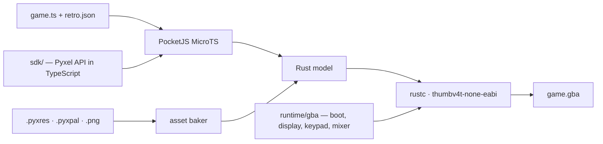

- **The SDK is the engine.** Drawing, tilemaps, input, the sound sequencer
  and resources live in TypeScript in `sdk/`, compiled together with the game.
  Rasterization follows pyxel-core's `canvas.rs` with integer math.
- **The runtime only does what hardware does.** `runtime/gba` boots the
  console, shows the game's indexed screen and palette in Mode 4, samples the
  keypad, synthesizes the voices the sequencer asks for and paces frames.
- **Every cycle is counted.** A frame at 30 fps has 561,792 CPU cycles for
  the game and for copying its screen to video memory. Each ROM reports its
  cycles, late frames and memory every second, and `tests/games.test.ts`
  plays every game and fails on a late frame.

[AGENTS.md](AGENTS.md) describes the architecture, the memory layout and the
performance rules in full.

## Project layout

| Path           | Contents                                                             |
| -------------- | -------------------------------------------------------------------- |
| `sdk/`         | The Pyxel API in TypeScript, imported by games as `"retro"`          |
| `runtime/gba/` | The bare-metal Rust host: display, keypad, sound mixer, memory       |
| `games/`       | Ported games, each with `game.ts`, `retro.json` and its resources    |
| `tools/`       | Build, headless run, profiler, resource baking, README media         |
| `skills/`      | The `port-pyxel-game` skill for coding agents                        |
| `pocketjs/`    | [PocketJS](https://github.com/pocket-nexus/pocketjs), as a submodule |

## Acknowledgements

Pocket Retro would not exist without **[Pyxel](https://github.com/kitao/pyxel)**
by [Takashi Kitao](https://github.com/kitao). Its API, the behavior of its
drawing and sound, its 4 × 6 font and its palette are what the SDK
reproduces, following the source of pyxel-core (MIT License), and most of the
games here are Pyxel's own examples and apps. If you enjoy these games, please
[star Pyxel](https://github.com/kitao/pyxel), read its
[user guide](https://kitao.github.io/pyxel/web/user-guide/) and make games
with it. Pocket Retro is an independent project and is not affiliated with or
endorsed by Pyxel.

The games are the work of their authors, ported with their resources:
Takashi Kitao (Pyxel Jump, Platformer, Shooter and Draw API, and Space
Rescue, Mega Wing and Cursed Caverns from his
[book on Pyxel](https://gihyo.jp/book/2025/978-4-297-14657-3)), Marcus
Croucher (Snake!), and [Adam](https://github.com/helpcomputer) (30 Seconds of
Daylight, Megaball and Laser Jetman), with Megaball's sound and music by Mike
Richmond. All of them are MIT licensed; thank you for sharing them.

Pocket Retro is built on [PocketJS](https://github.com/pocket-nexus/pocketjs)
and its MicroTS compiler, and its tools play ROMs headless in
[mGBA](https://mgba.io).

Game Boy Advance is a trademark of Nintendo. This project is not affiliated
with or endorsed by Nintendo.

## License

Pocket Retro is released under the [MIT License](LICENSE). The ported games
and their resources keep their authors' licenses, all MIT; see
[THIRD_PARTY_NOTICES.md](THIRD_PARTY_NOTICES.md).
